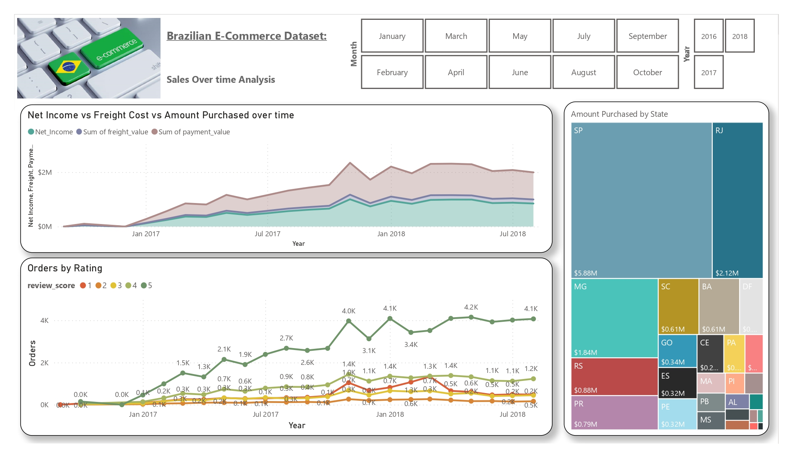

# Project 4 - Data Visualization using Power-Bi
---
---

<p align="center">
    
</p>

---
---

The purpose of this project is to create a dashboard using any of the tools seen during this module (Tableau/Power-Bi), in my case I will be using Power-Bi.

The topic selected for this project aimes to understand a Brazilian E-Commerce website that was launched in 2016 and operated in multiple marketplaces in Brazil.


<p align="center">
    
</p>

---
---
##  Table of Content:
   #### 1. Organization of the repo/project
   #### 2. Data
   #### 3. Visualizations
   #### 4. Conclusions
   #### 5. Links and Resources

***
### 1. Organization of the repo/project
***
```python
/dashboard
    Brazilian_E-Commerce_Viz.pbix
/data
    olist_customers_dataset.csv
    olist_geolocation_dataset.csv
    olist_order_items_dataset.csv
    olist_order_payments_dataset.csv
    olist_order_reviews_dataset.csv
    olist_orders_dataset.csv
    olist_products_dataset.csv
    olist_sellers_dataset.csv
    product_category_name_translation.csv
/images
    brazil-e-commerce-data-schema.jpg
    brazil-e-commerce-market-research-data.jpg
    Brazilian_E-Commerce_Viz_page-0001.jpg
    Brazilian_E-Commerce_Viz_page-0002.jpg
    Brazilian_E-Commerce_Viz_page-0003.jpg
    data_schema.png
.gitignore
Brazilian_E-Commerce_Viz.pdf
README.md
```

***
### 3. Data information:
***
This is a Brazilian e-commerce public dataset of orders made from Olist Store. The dataset contains real commercial data and it has been anonymised by the owner. 
This dataset has been downloaded from Kaggle and it contains information of 100k orders from 2016 to 2018 made at multiple marketplaces in Brazil. The dataset is divided into 9 csv files, which allows viewing an order from multiple dimensions: from order status, price, payment and freight performance to customer location, product attributes and finally reviews written by customers. I also contains a geolocation dataset that relates Brazilian zip codes to lat/lng coordinates.

This is the schema of the dataset from the website:


***
### 4. Visualizations
***
1. Once the data has been downloaded and uploaded into Power-bi, the schema sctructure after connecting all the tables, looks like this:


2. After analyzing and making all the connections of the data model, we can understand the the potential client will be intesrested to have a good and clear view of the following: 
- Inventory & Customer Satisfaction: quick view of the top 20 categories with the highest amount in stock, the overall satisfaction of the clients, % of the misses vs delivery on time and a quick overview of the words most used by customers which gives a better view on the customer satisfaction.


- Customer misses by Status Order: a map view of the impact on deliveries not being on time vs the goods delivered on time with the possibility of filtering by  status order and miss type (true/false) to see where the business is failing with the logistics and the pormisses to the customers.


- Sales over time: visualizations on sales comparing the purchases of customers, the cost of freight and the net income. A view of the orders by raitings and the amount purchased by state which allows the user the posibility of filtering by state, month and year of the sales and orders placed by customers.




***
### 5. Conclusions
***
Based on the visaulizations created, we can understand the business as follows:
- Inventory: The category that has the highest amount of money invested is health and beauty, which represents over 11% of all the categories acountable for $1.25M (in all 3 years)
- Customer Stasifaction: 92.13% of all orders were delivered on time and only 7.87% failed to be delievered as promised (in all 3 years). The year with the lowest number of misses was 2016 (1.22%) and 2018 was the year with the most (9.16%). The overall customer satisfaction by ratings on the products sold on the website is 4.09.
- Customer Misses: In total there has been placed 99.44K orders by customers, out of which 91.61K were delivered on time (92.13%) with an average of 12.59 hours of delivery. On the other hand, there has been 7827 orders that faild to acomplish with the promised time for delivery with an average of 9.55 hours late from the promised time.
- Sales: It is clear that 2016 was the year of the launch of the website with the lowest amount of sales and reviews by orders. November 2017 was the month and year with the highest amount of sales, leaveing a net income to the company of $1M with a big amount of orders (4K) for products with a 5.0 rating. During the 3 years, the state of Sao Paulo has been the biggest purchaser increasing year over year and representing over 37% of all purchases ($5.8M total).

<p align="center">
    
</p>

***
### 6. Links and Resources
***
- Data sources: 
1. Brazilian E-Commerce Public Dataset by Olist (Kaggle): https://www.kaggle.com/datasets/olistbr/brazilian-ecommerce


- Other useful links:
    - https://powerbi.microsoft.com/es-es/desktop/
    - https://www.kaggle.com/